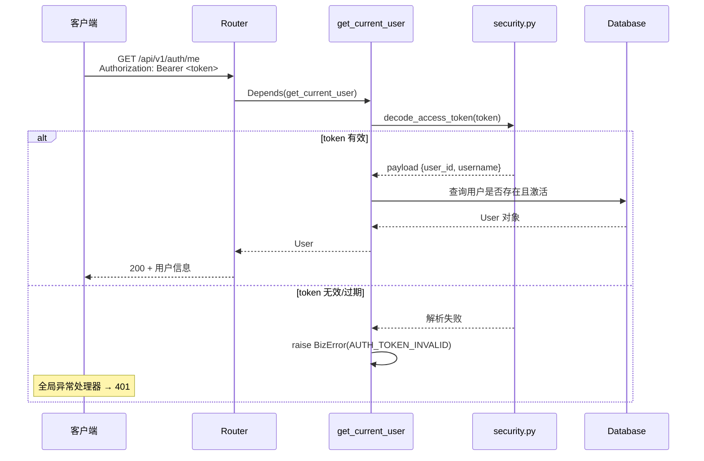

# 用户模块 MVP 设计

---

## 一、模块定位

用户模块属于 **⑤ 画像与行为域**，负责用户身份认证（注册 / 登录 / 鉴权）。

**设计原则**：
- 用户表只存身份认证必需字段，保持纯粹
- 用户画像、偏好等后续通过 `user_profiles` 表扩展，通过 `user_id` 外键关联
- 登录注册逻辑内聚在 `profile` 域

---

## 二、用户表设计

### 2.1 users 表（MVP）

```sql
CREATE TABLE users (
    id            BIGINT PRIMARY KEY AUTO_INCREMENT,
    username      VARCHAR(50)  NOT NULL UNIQUE COMMENT '用户名，唯一',
    password_hash VARCHAR(255) NOT NULL        COMMENT 'bcrypt 哈希',
    is_active     BOOLEAN      DEFAULT TRUE    COMMENT '账号是否激活',
    created_at    DATETIME     DEFAULT CURRENT_TIMESTAMP,
    updated_at    DATETIME     DEFAULT CURRENT_TIMESTAMP ON UPDATE CURRENT_TIMESTAMP
);

-- 索引
CREATE UNIQUE INDEX idx_users_username ON users(username);
```

### 2.2 后续扩展（非 MVP）

```sql
-- 用户画像表（后续新增）
CREATE TABLE user_profiles (
    id          BIGINT PRIMARY KEY AUTO_INCREMENT,
    user_id     BIGINT NOT NULL UNIQUE,
    nickname    VARCHAR(100),
    avatar_url  VARCHAR(500),
    preferences JSON COMMENT '偏好 JSON',
    created_at  DATETIME DEFAULT CURRENT_TIMESTAMP,
    updated_at  DATETIME DEFAULT CURRENT_TIMESTAMP ON UPDATE CURRENT_TIMESTAMP,
    FOREIGN KEY (user_id) REFERENCES users(id)
);
```

---

## 三、接口设计

| 方法 | 路径 | 功能 | 认证 |
|------|------|------|------|
| POST | `/api/v1/auth/register` | 用户注册 | ❌ |
| POST | `/api/v1/auth/login` | 用户登录 | ❌ |
| GET  | `/api/v1/auth/me` | 获取当前用户 | ✅ Bearer Token |

### 3.1 注册

**Request**:
```json
{
  "username": "alice",
  "password": "mypassword"
}
```

**Response (成功)**:
```json
{
  "code": 0,
  "data": {
    "id": 1,
    "username": "alice",
    "created_at": "2026-06-24T14:00:00"
  },
  "message": "success"
}
```

**业务规则**:
- 用户名 3~50 字符，唯一
- 密码最短 6 位
- 重复注册返回 `ErrorCode.USER_ALREADY_EXISTS`

### 3.2 登录

**Request**:
```json
{
  "username": "alice",
  "password": "mypassword"
}
```

**Response (成功)**:
```json
{
  "code": 0,
  "data": {
    "access_token": "eyJhbGciOiJIUzI1NiIs...",
    "token_type": "bearer"
  },
  "message": "success"
}
```

**业务规则**:
- 用户名或密码错误统一返回 `ErrorCode.AUTH_CREDENTIALS_INVALID`（不泄露哪个字段错）
- 账号被禁用返回 `ErrorCode.USER_DISABLED`

### 3.3 获取当前用户

**Request**:
```
GET /api/v1/auth/me
Authorization: Bearer <access_token>
```

**Response**:
```json
{
  "code": 0,
  "data": {
    "id": 1,
    "username": "alice",
    "is_active": true,
    "created_at": "2026-06-24T14:00:00"
  },
  "message": "success"
}
```

---

## 四、分层架构

```
┌──────────────────────────────────────────────────┐
│  profile/router.py — 路由层                       │
│  接收 HTTP 请求 → 调用 Service → 返回统一响应     │
├──────────────────────────────────────────────────┤
│  profile/service.py — 业务逻辑层                  │
│  注册：查重 → 哈希密码 → 存库                    │
│  登录：查用户 → 验密码 → 签 JWT                  │
│  抛 BizError，不关心 HTTP 细节                   │
├──────────────────────────────────────────────────┤
│  profile/repository.py — 数据访问层               │
│  get_by_username / create_user                   │
│  纯数据访问，不含业务判断                        │
├──────────────────────────────────────────────────┤
│  profile/models.py — ORM 模型层                   │
│  SQLAlchemy 异步 ORM 映射                        │
├──────────────────────────────────────────────────┤
│  infra/database.py — 数据库基础设施               │
│  AsyncEngine + AsyncSession + get_db 依赖注入    │
└──────────────────────────────────────────────────┘
```

---

## 五、鉴权流程



---

## 六、文件清单

| # | 文件路径 | 状态 | 职责 |
|---|----------|------|------|
| 1 | `app/infra/database.py` | 改造 | 异步数据库连接（替换占位） |
| 2 | `app/profile/models.py` | 新建 | User ORM 模型 |
| 3 | `app/profile/schemas.py` | 改造 | 请求/响应 Pydantic Schema |
| 4 | `app/profile/repository.py` | 新建 | 数据访问层 |
| 5 | `app/profile/service.py` | 改造 | 注册/登录业务逻辑 |
| 6 | `app/profile/dependencies.py` | 新建 | `get_current_user` 鉴权依赖 |
| 7 | `app/profile/router.py` | 新建 | 用户域路由 |
| 8 | `app/gateway/router.py` | 改造 | 挂载用户域子路由 |
| 9 | `app/main.py` | 改造 | startup 建表 |

---

## 七、实现顺序

```
Step 1: infra/database.py      — 异步数据库引擎 + session 工厂
Step 2: profile/models.py      — User ORM 模型定义
Step 3: profile/schemas.py     — RegisterReq / LoginReq / UserOut / TokenOut
Step 4: profile/repository.py  — get_by_username / create_user
Step 5: profile/service.py     — register / login / get_me 业务逻辑
Step 6: profile/dependencies.py— get_current_user 依赖注入
Step 7: profile/router.py      — POST /register, POST /login, GET /me
Step 8: gateway/router.py      — include 用户域路由
Step 9: main.py                — startup 事件中 create_all
```

---

## 八、依赖项

已完成的基础设施（直接复用）：
- `infra/toolkit/security.py` — `hash_password` / `verify_password` / `create_access_token` / `decode_access_token`
- `shared/exceptions.py` — `BizError` + `ErrorCode`
- `shared/response.py` — `success()` / `fail()`
- `shared/i18n.py` — 多语言错误消息
- `gateway/error_handler.py` — 全局异常处理器

新增依赖（pyproject.toml）：
- `aiomysql` — MySQL 异步驱动
- `sqlalchemy[asyncio]` — 已有，确认版本支持 async

---

## 九、MVP 简化决策

| 决策 | 理由 |
|------|------|
| 不用 Alembic | MVP 直接 `create_all`，后续引入迁移 |
| 不做 refresh_token | JWT 7 天过期够用，后续再加双 token |
| 不做邮箱/手机号 | 最简路径，只用 username + password |
| 密码最短 6 位 | 有对应 ErrorCode 支持 |
| 不做 rate limit | 后续接入层中间件统一处理 |
| 不做软删除 | `is_active` 覆盖禁用场景即可 |

---

## 十、ErrorCode 覆盖

| ErrorCode | HTTP Status | 场景 |
|-----------|-------------|------|
| `USER_ALREADY_EXISTS` | 409 | 注册时用户名重复 |
| `USER_PASSWORD_TOO_SHORT` | 400 | 密码少于 6 位 |
| `AUTH_CREDENTIALS_INVALID` | 401 | 用户名或密码错误 |
| `AUTH_TOKEN_INVALID` | 401 | Token 无效或过期 |
| `AUTH_TOKEN_EXPIRED` | 401 | Token 已过期 |
| `USER_DISABLED` | 403 | 账号被禁用 |

---

## 十一、用户画像模块

### 11.1 模块定位

用户画像模块管理用户的个性化偏好数据，是**路线引擎**的核心输入之一。画像数据决定了：
- POI 排序策略（餐饮偏好、休闲偏好）
- 预算过滤阈值
- 排队容忍度判断
- 交通方式推荐
- 步行距离限制

**设计原则：**
- 画像表与 users 表通过 `user_id` 关联，职责分离
- 用户只管理"基础配置"，不暴露算法权重
- 行为学习的画像更新走后台异步，不通过此接口

### 11.2 user_profiles 表

```sql
CREATE TABLE user_profiles (
    id                       BIGINT PRIMARY KEY AUTO_INCREMENT,
    user_id                  BIGINT NOT NULL UNIQUE,
    home_cities              JSON COMMENT '常驻城市列表（数组，如 ["北京","天津"]），仅用于冷启动推荐，可空',
    home_locations           JSON COMMENT '常用出发地列表',
    budget_level             VARCHAR(20) DEFAULT '100-200' COMMENT '人均预算档位',
    transport_preferences    JSON COMMENT '交通偏好数组 ["taxi","metro","bus","walk"]',
    queue_tolerance_minutes  INT DEFAULT 15 COMMENT '排队容忍分钟数',
    walking_tolerance_meters INT DEFAULT 1000 COMMENT '步行容忍米数',
    food_preferences         JSON COMMENT '餐饮偏好数组',
    leisure_preferences      JSON COMMENT '休闲偏好数组',
    frequent_areas           JSON COMMENT '常去商圈数组',
    is_initialized           BOOLEAN DEFAULT FALSE COMMENT '是否完成首次配置',
    created_at               DATETIME DEFAULT CURRENT_TIMESTAMP,
    updated_at               DATETIME DEFAULT CURRENT_TIMESTAMP ON UPDATE CURRENT_TIMESTAMP,
    FOREIGN KEY (user_id) REFERENCES users(id)
);

-- 索引
CREATE UNIQUE INDEX idx_user_profiles_user_id ON user_profiles(user_id);
```

> **关于城市字段的设计说明：**
> - `home_cities`：用户的常驻城市列表（数组），仅在冷启动时作为默认推荐城市参考，**非必填**
> - **当前会话城市**（用户本次想规划路线的目标城市）不存数据库，由前端管理（localStorage `lastUsedCity`），每次请求作为参数传递给后端路线引擎
> - 后续随其他核心模块迭代，画像表字段会持续优化调整

### 11.3 接口设计

| 方法 | 路径 | 功能 | 认证 |
|------|------|------|------|
| POST | `/api/v1/user/profile/init` | 首次画像配置（onboarding） | ✅ Bearer Token |
| GET | `/api/v1/user/profile` | 获取当前用户画像 | ✅ Bearer Token |
| PATCH | `/api/v1/user/profile` | 部分更新画像字段 | ✅ Bearer Token |

#### 11.3.1 POST /api/v1/user/profile/init

首次 onboarding 完成时调用，创建画像记录并标记已初始化。

**Request:**
```json
{
  "home_cities": ["北京", "天津"],
  "budget_level": "100-200",
  "transport_preferences": ["taxi", "metro"],
  "queue_tolerance_minutes": 15,
  "walking_tolerance_meters": 1000,
  "food_preferences": ["烤肉", "日料"],
  "leisure_preferences": ["KTV", "足疗"]
}
```

**Response (成功):**
```json
{
  "code": 0,
  "data": {
    "is_initialized": true
  },
  "message": "success"
}
```

**业务规则：**
- 已初始化过的用户重复调用 → `ErrorCode.PROFILE_ALREADY_INITIALIZED`（409）
- 跳过画像（空 body 或所有字段为空）→ 创建默认画像，使用各字段的 DEFAULT 值
- 所有字段均为可选，未提供的使用数据库默认值

#### 11.3.2 GET /api/v1/user/profile

**Response (成功):**
```json
{
  "code": 0,
  "data": {
    "home_cities": ["北京", "天津"],
    "home_locations": ["国贸"],
    "budget_level": "100-200",
    "transport_preferences": ["taxi", "metro"],
    "queue_tolerance_minutes": 15,
    "walking_tolerance_meters": 1000,
    "food_preferences": ["烤肉", "日料"],
    "leisure_preferences": ["KTV", "足疗"],
    "frequent_areas": ["国贸", "望京", "三里屯"],
    "is_initialized": true
  },
  "message": "success"
}
```

**业务规则：**
- 未初始化 → `ErrorCode.PROFILE_NOT_FOUND`（404）

#### 11.3.3 PATCH /api/v1/user/profile

部分更新，只传需要修改的字段。

**Request:**
```json
{
  "budget_level": "200+",
  "food_preferences": ["烤肉", "日料", "火锅"]
}
```

**Response (成功):**
```json
{
  "code": 0,
  "data": {
    "home_cities": ["北京", "天津"],
    "home_locations": ["国贸"],
    "budget_level": "200+",
    "transport_preferences": ["taxi", "metro"],
    "queue_tolerance_minutes": 15,
    "walking_tolerance_meters": 1000,
    "food_preferences": ["烤肉", "日料", "火锅"],
    "leisure_preferences": ["KTV", "足疗"],
    "frequent_areas": ["国贸", "望京", "三里屯"],
    "is_initialized": true
  },
  "message": "success"
}
```

**业务规则：**
- 未初始化 → `ErrorCode.PROFILE_NOT_FOUND`（404）
- 不允许修改 `is_initialized` 字段
- 返回更新后的完整画像

### 11.4 /auth/me 接口改造

在 `/auth/me` 返回中新增 `has_profile` 字段，前端据此判断是否需要跳转 onboarding：

```json
{
  "code": 0,
  "data": {
    "id": 1,
    "username": "alice",
    "is_active": true,
    "has_profile": false,
    "created_at": "2026-06-24T14:00:00"
  },
  "message": "success"
}
```

**实现方式：** Service 层查询 `user_profiles` 表，判断该 user_id 是否存在且 `is_initialized = true`。

### 11.5 新增 ErrorCode

| ErrorCode | HTTP Status | 场景 |
|-----------|-------------|------|
| `PROFILE_ALREADY_INITIALIZED` | 409 | 重复初始化画像 |
| `PROFILE_NOT_FOUND` | 404 | 未初始化就查询/更新画像 |

### 11.6 Pydantic Schema

```python
# app/profile/profile_schemas.py

class ProfileInitRequest(BaseModel):
    """画像初始化请求 — 所有字段可选（跳过 = 使用默认值）"""
    home_cities: Optional[List[str]] = Field(None, description="常驻城市列表")
    home_locations: Optional[List[str]] = None
    budget_level: Optional[str] = Field(None, max_length=20)
    transport_preferences: Optional[List[str]] = None
    queue_tolerance_minutes: Optional[int] = Field(None, ge=0, le=120)
    walking_tolerance_meters: Optional[int] = Field(None, ge=0, le=5000)
    food_preferences: Optional[List[str]] = None
    leisure_preferences: Optional[List[str]] = None

class ProfileUpdateRequest(BaseModel):
    """画像更新请求 — 只传需要修改的字段"""
    home_cities: Optional[List[str]] = Field(None, description="常驻城市列表")
    home_locations: Optional[List[str]] = None
    budget_level: Optional[str] = Field(None, max_length=20)
    transport_preferences: Optional[List[str]] = None
    queue_tolerance_minutes: Optional[int] = Field(None, ge=0, le=120)
    walking_tolerance_meters: Optional[int] = Field(None, ge=0, le=5000)
    food_preferences: Optional[List[str]] = None
    leisure_preferences: Optional[List[str]] = None
    frequent_areas: Optional[List[str]] = None

class ProfileOut(BaseModel):
    """画像响应"""
    home_cities: Optional[List[str]]
    home_locations: Optional[List[str]]
    budget_level: str
    transport_preferences: Optional[List[str]]
    queue_tolerance_minutes: int
    walking_tolerance_meters: int
    food_preferences: Optional[List[str]]
    leisure_preferences: Optional[List[str]]
    frequent_areas: Optional[List[str]]
    is_initialized: bool
```

### 11.7 文件清单

| # | 文件路径 | 状态 | 职责 |
|---|----------|------|------|
| 10 | `app/profile/profile_models.py` | 新建 | UserProfile ORM 模型 |
| 11 | `app/profile/profile_schemas.py` | 新建 | 画像相关 Pydantic Schema |
| 12 | `app/profile/profile_repository.py` | 新建 | 画像数据访问层 |
| 13 | `app/profile/profile_service.py` | 新建 | 画像初始化/查询/更新逻辑 |
| 14 | `app/profile/profile_router.py` | 新建 | 画像相关路由 |

### 11.8 实现顺序

```
Step 10: profile/profile_models.py      — UserProfile ORM 模型
Step 11: profile/profile_schemas.py     — 画像 Schema
Step 12: profile/profile_repository.py  — create_profile / get_by_user_id / update_profile
Step 13: profile/profile_service.py     — init_profile / get_profile / update_profile
Step 14: profile/profile_router.py      — POST /init, GET /, PATCH /
Step 15: gateway/router.py              — 挂载画像路由前缀 /api/v1/user/profile
Step 16: 改造 auth service              — /me 返回 has_profile 字段
```

### 11.9 画像字段选项参考

基于小路书业务特征，各字段的可选值范围：

| 字段 | 可选值示例 |
|------|-----------|
| home_cities | ["北京"]、["北京","天津"]、["上海","杭州"]（数组，可多选） |
| budget_level | "0-50"、"50-100"、"100-200"、"200-500"、"500+" |
| transport_preferences | taxi、metro、bus、walk、bike、drive |
| queue_tolerance_minutes | 0、5、10、15、20、30、45、60 |
| walking_tolerance_meters | 300、500、800、1000、1500、2000 |
| food_preferences | 烤肉、日料、火锅、川菜、粤菜、西餐、咖啡、甜品、小吃 |
| leisure_preferences | KTV、足疗、电影、密室逃脱、剧本杀、桌游、健身、SPA |
| frequent_areas | 用户自由输入（如：国贸、望京、三里屯、五道口） |

### 11.10 MVP 简化决策（画像模块）

| 决策 | 理由 |
|------|------|
| 不做画像版本管理 | MVP 直接覆盖更新 |
| frequent_areas 由用户手动维护 | 后续可通过行为日志自动推断 |
| 不做偏好权重 | MVP 各偏好等权，后续引入 AI 学习权重 |
| JSON 字段不做 JSON Schema 校验 | MySQL JSON 类型存储，应用层 Pydantic 校验即可 |
| 不做画像完整度打分 | 后续可用于引导用户补全 |
