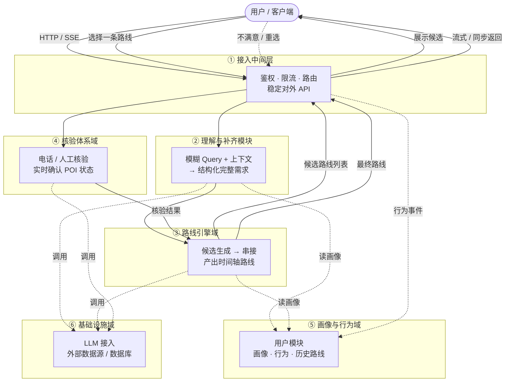
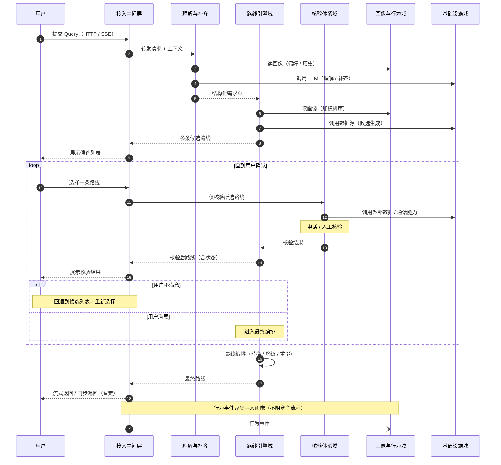

# 小路书 整体架构

---

## 一、整体架构

系统按职责划分为以下几个大域：

### 接入中间层

流量入口，做鉴权 / 限流等，保证一个稳定的对外 API。**MVP 版本保留架构即可**。

### 理解与补齐模块

把用户的模糊 Query + 上下文，变成结构化、完整的路线需求。

### 路线引擎域

基于需求单，产出候选并串成时间轴一条或多条可执行路线。

### 核验体系域

基于路线单，通过电话 / 人工的方式去核验，对路线做实时的状态确认。

### 画像与行为域

包含用户模块，记录用户偏好，记录行为、保存历史路线 —— 画像快照、行为流、历史路线等。

### 基础设施域

封装 LLM 和外部数据源（数据库等）。

---

## 二、域职责一览

| 序号 | 大域 | 职责 | 关键产出 |
|------|------|------|----------|
| ① | **接入中间层** | 流量入口，鉴权 / 限流，保证稳定的对外 API | 对外 API（MVP 保留架构） |
| ② | **理解与补齐模块** | 把模糊 Query + 上下文 → 结构化完整需求 | 一份"条件齐全"的需求单 |
| ③ | **路线引擎域** | 基于需求单产出候选，并串成时间轴路线 | 一条或多条可执行路线 |
| ④ | **核验体系域** | 通过电话 / 人工核验，对路线做实时状态确认 | POI 的真实状态（营业 / 等位 / 时长等） |
| ⑤ | **画像与行为域** | 用户模块；记录偏好与行为；保存历史路线 | 画像快照、行为流、历史路线 |
| ⑥ | **基础设施域** | 封装 LLM 和外部数据源（数据库等） | 稳定的内部 SDK / 接口 |

---

## 三、主流程

```
用户 → 接入层 → 理解补齐 → 路线引擎（产出多条候选路线）
     → 接入层 → 用户【选择一条路线】
     → 核验 → 路线引擎（最终编排）→ 接入层 → 用户
```

设计要点：

- **多条候选 → 用户先选 → 再核验**：路线引擎产出候选后**先回到用户**做选择，**只对用户选中的那条**发起核验。
  - **理由**：一开始就对多条路线都做核验**不合理且成本高**（电话 / 人工核验有真实人力与时间成本）。
- **核验不通过可回退**：如果用户对核验结果不满意，**回退到候选列表重新选择**，再对新选中的路线发起核验，直至用户确认。
- **最终编排**：核验通过后，路线引擎做最终的替换 / 降级 / 重排，统一从接入层返回给用户。
- 接入层向用户的返回方式：**流式返回，或先做同步阻塞也行（MVP 暂定）**。

---

## 四、流程图

### 4.1 一级架构调用图



### 4.2 主流程时序图


